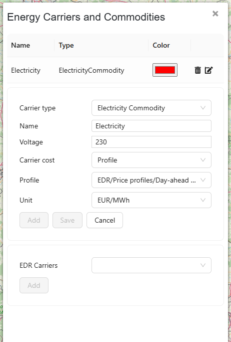

Advanced features
=================

ESSIM supports a set of advanced features to support a multitude of use cases.
This page will describe these advanced features.

Carrier prices
--------------

In many use cases prices of carriers, such as those of electricity and gas, are relevant to take in to account in
the decision to produce or consume energy. ESSIM supports these analyses by adding cost profiles to carriers (such as
``ElectricityCommodity`` or ``GasCommodity``). These cost will be taken automatically into account when configured.

Carrier Price Profiles
""""""""""""""""""""""

In ESDL, an `EnergyCarrier` can have a `cost` profile (of type ``GenericProfile``, so it can be a fixed ``SingleValue``
or some timeseries profile). ESSIM treats these profiles as **exogenous prices**.

**Role of Carrier Price Profiles**

1.  **Conversion Viability Check**:

    For `Conversion` assets (like heat pumps or electrolyzers), ESSIM uses the price profiles of the input and output
    carriers to determine if a conversion is economically viable at the current time step.

    - It calculates the weighted sum of input carrier prices and compares it with the weighted sum of output carrier
      prices (based on the conversion efficiencies/ratios).
    - If the output value is less than the input cost, the conversion node will generate a flat bid curve with zero
      energy (0 demand/supply), effectively disabling the conversion for that time step.
    - This behavior can be disabled by setting the environment variable ``DISABLE_PRICE_BASED_BID_DECISIONS=true``
      when starting ESSIM.

2.  **Default Marginal Cost**:
    If a `Producer` or `Consumer` asset does not have a specific marginal cost profile
    defined in its `CostInformation`, ESSIM uses the price profile of the connected carrier as the default
    marginal cost.

In the ESDL Mapeditor, you can add a profile to a carrier when opening the ESDL Carriers. See below for an example:

