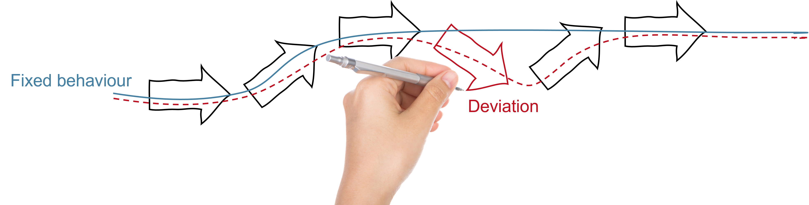

Modelling flexibility
=====================

.. note::
    This documentation is work in progress and far from finished. New sections will be added in the near future.
    Whenever questions or feedback is received from end users, we're trying to update this documentation on the fly.
    So don't hesitate to contact us, whenever you run into problems.

..

Energy flexibility is the ability of an energy producing/consuming device to deviate from a planned or expected state. A device may be flexible in the amount of energy or time.

  .. figure:: ../images/flexibility-table.png
    :scale: 20 %  
    :align: center

    Examples of flexible devices

Bid Curves
----------
ESSIM uses the language of bid curves to represent the flexibility of an asset. A bid curve is a monotonically decreasing, continuous function of energy over price. This *price* is different from a tariff in that it represents the need of a producer/consumer instead of the money paid or received. In ESSIM, this is expressed as a range of values between 0 and 1. An important feature of a bid curve is a marginal cost. This is the price beyond which consumption becomes unprofitable and/or production becomes profitable. To distinguish between production and consumption on a bid curve, energy production is represented as negative values and energy consumption as positive values. A flat bid curve represents inflexible behaviour.

  .. figure:: ../images/bidcurve.png
    :scale: 20 %  
    :align: center

  An example bid curve of a prosumer (a device that can consume and produce energy, e.g. battery) with a marginal cost between 0.4 and 0.5.

Such a characterisation of energy flexibility allows for:
  * Modelling a *rational* behaviour of devices in an energy system where producers try to maximise their profit and consumers try to minimise their expenses
  * Preparing a merit-order of producers where cheaper producers are scheduled first, and one of consumers where more expensive consumers get a priority

In ESSIM, this flexibility is used by the transport network model to balance demand and supply of energy in each time step.

  .. figure:: ../images/transport-solver.gif
    :scale: 80 %  
    :align: center

  The network model using bid curves to match demand and supply

*Fact: In addition to allocation at the leaf nodes, the allocations at the branch (transport asset) nodes describe the energy flowing through that transport asset*

Local ESSIM assets & bid curves
^^^^^^^^^^^^^^^^^^^^^^^^^^^^^^^
To construct a bid curve, two essential pieces of information about the device is needed - its capacity and its desirability at that time step. An asset's capacity to produce or consume energy is determined from its ESDL description, in case of flexible behaviour and from an attached profile, in case of inflexible behaviour. The exception to this rule is a storage asset whose flexibility at a given time depends on its state of charge at that moment. On the other hand, the desirability of an asset, designated by its marginal cost, is subjective to what the energy system modeller wants to achieve. For e.g, a highly polluting producer can be designated with a high marginal cost whereas renewable energy sources may have a marginal cost of 0.0. A behaviour of exporting only excess generation from a grid can be modelled by using a consumer with very low marginal cost. Such a consumer's demand will only be satisfied after the other highly paying consumers.

  .. figure:: ../images/gh-flex.png
    :scale: 20 %  
    :align: center

  Creating the bid curve for a flexible gas heater. A curve with only a negative part indicates that this device is incapable of consuming energy. A high marginal cost indicates that it will be scheduled only after cheaper sources of heat such as heat pumps if present in the network.

  .. figure:: ../images/storage-flex.png
    :scale: 25 %  
    :align: center

  Creating the bid curve for a storage. This curve has a positive and negative side determined by its state of charge and its maximum charging and discharging powers. The marginal cost in this case can be fixed or can keep changing based on the fill level of the storage.

In case the behaviour of a device is pre-determined to follow a certain profile, then the device is said to have no flexibility. In ESSIM, these devices produce flat bid curves. The amplitude of these curves change with respect to the value of the profile at that time step.

  .. figure:: ../images/profile-inflex-bidcurve.png
    :scale: 30 %  
    :align: center

  Bid curve for an inflexible device.

Remote assets & bid curves
^^^^^^^^^^^^^^^^^^^^^^^^^^

ESSIM also has a provision to connect to a remote device model via MQTT. The skeleton for such a model, implemented in Python, can be found in `this`_ repository. With the help of such a model, more complex asset behaviours can be modelled compared to ESSIM's rudimentary model library as long as the model can create a bid curve for each time step representing its flexibility at that moment.

.. _this: https://github.com/ESDLMapEditorESSIM/essim-remote-model.

  .. figure:: ../images/remote-node.png
    :scale: 20 %  
    :align: center

  A remote (external) device model interacting with ESSIM.