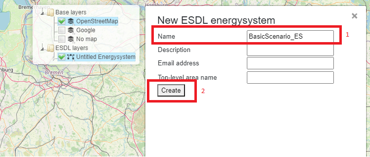
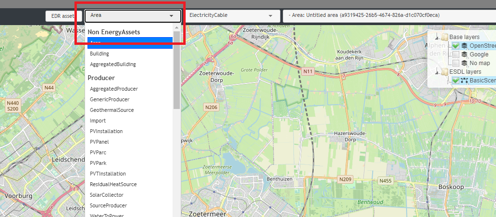
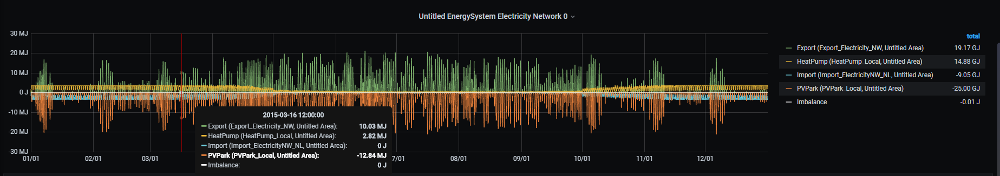
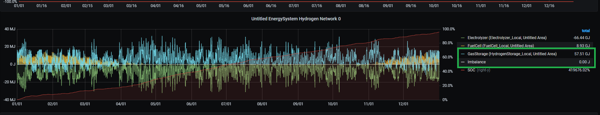

ESDL MapEditor ESSIM tutorials
==============================

This set of tutorials demonstrate how to use the MapEditor to create and
configure energy systems and how to run and interpret basic and complex
scenarios using ESSIM.

Tutorial 1: Basic Energy System
-------------------------------

Description
~~~~~~~~~~~

The basic scenario models a simple *EnergySystem* consisting of a
*HeatingDemand*, a *GasHeater* and an *Import* from the backbone gas
network.

The dashed line indicates the *EnergySystem* boundaries. In the example
above, gas is imported from an external gas source, *Import*, to the
*EnergySystem* where a conversion, *GasHeater*, converts this gas to
heat and supplies it to meet the *HeatingDemand*.

Creating an EnergySystem
~~~~~~~~~~~~~~~~~~~~~~~~

To create this *EnergySystem* in MapEditor, start by creating a new ESDL
file.

-  Hover over the ***File*** dropdown menu and click on ***New ESDL***

*Figure 1: Creating a new ESDL*

This opens up a pop-up window, where details such as *Name*,
*Description*, *Email address* and *Top-level area name* can be
specified. Enter the desired details as in Figure 2 (1) and click on
***Create*** (2).

*Figure 2: Specifying details of a new EnergySystem*

This creates a new, empty *EnergySystem*, named "BasicScenario\_ES", to
which ESDL elements can now be added. The elements can be added anywhere
on the map, and specific locations can be found by navigating the map.

The basic *EnergySystem* in this example consists of three
*EnergyAssets*: *HeatingDemand*, *GasHeater* and *Import*.

-  To add each of these *EnergyAssets*, use the first dropdown menu next
   to ***EDR asset*** menu item.

*Figure 3: Selecting an EnergyAsset to create*

-  Clicking on the dropdown menu opens a list of Assets to choose from.

-  Navigate to the *HeatingDemand* menu item and click on it.

*Figure 4: Selecting a new HeatingDemand to create*

This creates a *HeatingDemand* icon next to the mouse cursor that can be
placed on the map.

-  Position the mouse cursor on anywhere on the map and create the
   *EnergyAsset* by clicking on the map.

*Figure 5: Selecting a location for a new EnergyAsset*

This creates a *HeatingDemand*, indicated by its icon (see the green
circle in Figure 6).

-  Click ***Cancel*** on the left menu bar (or press the Esc key) to
   complete the action.

*Figure 6: Creating an EnergyAsset on the map*

Follow the same steps to create *GasHeater* and *Import*. The created
energy system show look as that in Figure 7

*Figure 7: An EnergySystem with Import, GasHeater and HeatingDemand*

The next step is to configure the created *EnergySystem* and its
*EnergyAssets* by adding *Carriers* and/or *Commodities*, creating
connection between the *Assets*, configuring the individual *Assets* by
specifying optional and required parameters for an ESSIM simulation
(such as, for example, load and production profiles, power etc.). The
following subsection demonstrates how to do this.

Configuring an EnergySystem
~~~~~~~~~~~~~~~~~~~~~~~~~~~

To run an ESSIM simulation with a created *EnergySystem*, a number of
elements have to be configured. These include:

1. Connecting *Import*, *GasHeater* and *HeatingDemand*

2. Adding Gas and Heat energy *Commodities* and assigning them to
   *Import* (Gas) and *HeatingDemand* (Heat) *EnergyAssets*

3. Configuring the necessary parameters of *Import*, *GasHeater* and
   *HeatingDemand* (e.g. specifying power, efficiency, production type,
   name etc.)

4. Setting load profile of *HeatingDemand*

1. Connecting *Import*, *GasHeater* and *HeatingDemand*
^^^^^^^^^^^^^^^^^^^^^^^^^^^^^^^^^^^^^^^^^^^^^^^^^^^^^^^

The first step in configuring an *EnergySystem* is to connect the
created *EnergyAssets*. To connect the *Import* with *GasHeater*, follow
the steps indicated in Figure 8:

-  Mouseover the *Import* icon pops up a red square next to it,
   indicating an *OutPort*.

-  Click on the red square (Indicated as 1 in the left figure) and move the mouse to the
   *GasHeater* icon. A dashed line appears following the cursor.

-  Click on the blue square which appears next to *GasHeater*
   (indicating its *InPort*) (Indicated as 2 in the right picture). *Import* and *GasHeater* are now
   connected.

-  Repeat the same procedure to connect *OutPort* of *GasHeater* (red
   square) and *InPort* of HeatingDemand (blue square).

The sequence of these actions determines which *EnergyAssets* are
connected.

*Figure 8: Connecting EnergyAssets*

As a check, click on an asset and examine the information below
'Connections' in the popup window. For the *GasHeater*, the *InPort*
should be connected to *Import*, and the\ *OutPort* should be connected
to *HeatingDemand*, as shown in Figure 9. Check the connections of other
two *EnergyAssets* in a similar way.

*Figure 9: Verifying EnergyAsset connections*

*Figure 10: Connected EnergyAssets*

2. Adding Gas and Heat energy *Commodities* and assigning them to *Import* (Gas) and *HeatingDemand* (Heat) *EnergyAssets*
^^^^^^^^^^^^^^^^^^^^^^^^^^^^^^^^^^^^^^^^^^^^^^^^^^^^^^^^^^^^^^^^^^^^^^^^^^^^^^^^^^^^^^^^^^^^^^^^^^^^^^^^^^^^^^^^^^^^^^^^^^

The next step is to add energy *Carriers* and *Commodities*. In this
basic scenario, two Commodities exist: gas (imported from an external
system) and heat (as a result of *GasHeater* conversion). To add an
energy *Commodity*:

-  Mouseover the ***Edit*** menu item and click on ***Energy carriers***
   (see Figure 11).

A pop-up menu opens with a list of energy *Carriers* and *Commodities*
that can be added and configured.

*Figure 11: Adding a new Energy Commodity*

-  Click on the dropdown menu, and select *Gas commodity.*

-  Give it a descriptive name (1) and leave the other fields blank.

-  Click on ***Add carrier*** (2).

-  Repeat the same process to create a *Heat commodity*.

*Figure 12: Adding a Gas commodity*

3. Configuring the necessary parameters of Import, GasHeater and HeatingDemand (e.g. specifying power, efficiency, production type, name etc.)
^^^^^^^^^^^^^^^^^^^^^^^^^^^^^^^^^^^^^^^^^^^^^^^^^^^^^^^^^^^^^^^^^^^^^^^^^^^^^^^^^^^^^^^^^^^^^^^^^^^^^^^^^^^^^^^^^^^^^^^^^^^^^^^^^^^^^^^^^^^^^^

After creating energy *Commodities*, assign energy *Commodities* to an
*EnergyAsset* by right-clicking on its icon and selecting ***Set
carrier***. In this basic scenario, energy commodities must be added to
*Import* producer and *HeatingDemand* consumer. Selecting ***Set
carrier*** opens a pop-up menu with a list of *Commodities* to select
from.

-  Right click on *Import*.

-  Select ***Set carrier***.

-  Choose ***Gas commodity***.

The window automatically closes and the *Commodity* is set for the
selected *EnergyAsset*. Repeat the process for *HeatingDemand* and
select ***Heat commodity*** from the pop-up menu.

.. figure:: images/Tutorial1/Tutorial1_AddingEnergyCommodity.png
   :alt: 

*Figure 13: Setting Energy commodities*

After refreshing the browser (press F5), connections between
*EnergyAssets* should have different colors indicating different energy
*Commodities*.

*Figure 14: Colors indicating different energy Commodities*

4. Configuring the necessary parameters of *Import*, *GasHeater* and *HeatingDemand*
^^^^^^^^^^^^^^^^^^^^^^^^^^^^^^^^^^^^^^^^^^^^^^^^^^^^^^^^^^^^^^^^^^^^^^^^^^^^^^^^^^^^

The next step is to configure individual *EnergyAssets* by specifying
required and optional parameters.

-  Click on the *HeatingDemand icon* (see Figure 15) (1) . This opens up
   a pop-up menu with a number of configurable parameters.

In case of *HeatingDemand*, no parameters have to be changed for an
ESSIM simulation.

-  For the purpose of demonstration, set the **name** of the
   *HeatingDemand* to *HeatingDemand\_Local* (2).

-  Close the pop-up menu. Parameters changes are automatically saved
   (3).

*Figure 15: Configuring HeatingDemand*

Using a *GasHeater* in an ESSIM simulation requires specifying
**efficiency** (percentages) and **maximum power** (in Watts).

-  Right click on the GasHeater icon to see the pop up window.

-  Set the efficiency of the *GasHeater* to 0.9 (90%) (2).

-  Set the maximum power to 6000 Watts (3) (see Figure 16).

-  Close the menu (4).

*Figure 16: Configuring the GasHeater*

Using an Import in an ESSIM simulation requires specifying maximum power
(in Watts) and production type. Follow the steps from Figure 17.

-  Click on the *Import* icon (1).

-  Set power to 1000000 Watts (2). Fill in only the number, not the
   unit.

-  Set production type to *Fossil* (3)

-  Close the pop-up menu (4).

*Figure 17: Configuring the GasImport*

5. Setting load profile of *HeatingDemand*
^^^^^^^^^^^^^^^^^^^^^^^^^^^^^^^^^^^^^^^^^^

The next step in configuring an *EnergySystem* for a basic ESSIM
simulation is to add load and production profiles to *EnergyAssets*. In
this basic scenario, a **load** profile is set for *HeatingDemand*
*EnergyAsset*. To add a (load) profile:

-  Right-click on the *HeatingDemand* icon and select ***Set profile of
   InPort***.

*Figure 18: Setting profiles of EnergyAssets*

A pop-up window appears with a list of possible profiles to choose from.
*MapEditor* enables setting a range of load and production profiles,
depending on scenarios and types of *EnergyAssets*.

-  Click on the dropdown menu (labeled 'profile class').

-  Choose *Heating households (G1A)*, a heat demand profile of Dutch
   households, with hourly values.

*Figure 19: Choosing a load profile*

As this is a normalized yearly profile, specify a *Multiplier* (1) and
*Quantity and Unit* (2) for the profile. In this scenario, the yearly
heating demand is 50 GJ.

-  Fill in 50 in the field 'Multiplier'.

-  Select 'Energy in GJ' from the dropdown list 'Quantity and Unit'.

-  Click ***Add*** (3) to close the pop-up window.

*Figure 20: Setting a heating demand profile*

Saving the model
~~~~~~~~~~~~~~~~

Now is a good time to save the model. This model will be used in the
next tutorials, as a base configuration.

To save the created *EnergySystem*, mouseover ***File*** menu item (1)
and select ***Save ESDL*** (2) (see Figure 21). Save the file as
'Tutorial1\_Scenario.esdl'.

*Figure 21: Saving an EnergySystem*

Running an ESSIM simulation
~~~~~~~~~~~~~~~~~~~~~~~~~~~

Now that all the parameters are set, an ESSIM simulation can be run for
this *EnergySystem*. To run a simulation:

-  Click the "Play" button on the left-hand side menu (see Figure 22).

*Figure 22: Running an ESSIM simulation*

A pop-up window opens with ESSIM simulation parameters (see Figure 23).

-  Enter a simulation description (1).

-  Choose a year or a period to simulate (2). For this example, choose
   Year 2019.

-  Click ***Run*** (3) to run the simulation.

*Figure 23: Configuring an ESSIM simulation*

Once the simulation is finished, a link to a dashboard appears (see
Figure 24). Clicking on the link opens a dashboard with ESSIM simulation
results.

*Figure 24: Navigating to ESSIM simulation results*

Interpreting the results
~~~~~~~~~~~~~~~~~~~~~~~~

ESSIM simulation results are displayed in a Grafana dashboard in a
separate window. In the upper-right corner of the dashboard, Network
Balances are displayed, indicating any potential imbalances. In this
scenario, there are two networks: a gas network and a heat network.
ESSIM displays results for each of these networks separately. Both heat
and gas network are in balance, as indicated by a green **OK** flag (see
Figure 25).

*Figure 25: Network balances in an ESSIM simulation*

To see load, production and imbalance in each of the networks on an
hourly basis, scroll to the bottom of the page. As seen in Figure 26,
results for each of the networks are displayed in a separate panel. The
graphs show hourly data, while total production, demand and imbalance
per energy asset is displayed on the right-hand side. Production is
indicated by a negative sign, while demand is indicated by a positive
sign.

*Figure 26: Load, production and imbalance in networks*

To see details for a specific energy asset, for example the *GasHeater*,
click on its name in the Heat Network panel (see Figure 27).

*Figure 27: GasHeater production curve*

Tutorial 2: Not so basic Energy System
--------------------------------------

Description
~~~~~~~~~~~

This tutorial demonstrates how to set preferences for specific (types
of) producers in an *EnergySystem* to meet the demand of specific
consumers. To do so, the *EnergySystem* from the previous tutorial is
extended by adding another heat source, a *HeatPump*, which converts
electricity to heat. Both the *HeatPump* and the *GasHeater* are
connected to the same\ *HeatingDemand*. To produce heat, the *HeatPump*
is connected to an external electricity grid, an *Import*, and supplies
the heat to the *HeatingDemand*.

.. figure:: images/Tutorial2/Tutorial2_EnergySystem.png
   :alt: 

Loading the base configuration
~~~~~~~~~~~~~~~~~~~~~~~~~~~~~~

To continue with the model created in the previous tutorial, load the
'Tutorial1\_Scenario.esdl.

-  Select ***File*** (1).

-  Select ***Load ESDL*** (2) (see Figure 28).

-  Navigate to the file location and load the saved .esdl file.

*Figure 28: Loading an EnergySystem*

Creating and configuring a *HeatPump* and an electricity *Import*
~~~~~~~~~~~~~~~~~~~~~~~~~~~~~~~~~~~~~~~~~~~~~~~~~~~~~~~~~~~~~~~~~

To extend the basic *EnergySystem* from the previous tutorial, follow
these steps:

-  Create new *[EnergyAssets]*

   -  *Import EnergyAsset*

      -  Power: 1000000 W

      -  Production Type: Fossil

   -  *HeatPump EnergyAsset*

      -  Power: 3000 W

      -  Efficiency: 1.0 (100%)

      -  Coefficient of performance (COP): 3.0

-  Connect the *EnergyAssets*

   -  *OutPort* of the Import with the *InPort* of the *HeatPump*

   -  *OutPort* of the *HeatPump* with the *InPort* of the
      *HeatingDemand*

-  Create an electricity *Commodity*

-  Assign the electricity *Commodity* to the electricity Import

-  Re-assign the heat *Commodity* to the *HeatingDemand*

In this scenario, there are two heat sources supplying the
*HeatingDemand*: a *GasHeater* and a *HeatPump*. In the current setting,
an ESSIM simulation treats both sources equally and uses them at the
same time to meet the heating demand of the consumer (see Figure 29).

*Figure 29: HeatPump and GasDemand as producers of equal priority*

However, in this scenario, we would like to use the *HeatPump* to its
maximum capacity at all times, and use the *GasHeater* only at times
when there is not enough production from the *HeatPump*. Therefore,
*HeatPump* needs to have higher priority that the *GasHeater*.

Specifying marginal costs of *HeatPump* and *GasHeater EnergyAssets*
^^^^^^^^^^^^^^^^^^^^^^^^^^^^^^^^^^^^^^^^^^^^^^^^^^^^^^^^^^^^^^^^^^^^

ESSIM uses the concept of marginal costs to determine the priority of
*EnergyAssets* (or the order in which EnergyAssets are used). In ESSIM
they are specified in relative terms to each other, not in absolute
terms. They can have a minimum value of 0 (the cheapest producer) and a
maximum value of 1 (the most expensive producer). To meet an energy
demand, ESSIM first uses the cheapest producer (the highest priority) up
to its maximum power. Therefore, to determine the order in which heat
sources are used, marginal costs have to be set for *GasHeater* and
*HeatPump*. Since we want to first use the *HeatPump* at all times
possible, it will have lower marginal costs compared to that of the
*GasHeater*.

To set the marginal costs of the *HeatPump*;

-  Right-click on its icon (1) and select ***Set marginal costs*** (2)
   (see Figure 30).

*Figure 30: Setting marginal costs of the HeatPump*

-  Set the costs to 0.4 (1).

-  Click ***Set costs*** to save changes and close the window (2) (see
   Figure 31).

*Figure 31: Setting marginal costs of the HeatPump*

-  Repeat the same procedure for the *GasHeater*, but set its costs to
   0.6.

The priorities of heat producers are now set. Marginal costs can be
changed or checked following the same procedure of setting the initial
values. The *EnergySystem* scenario can now be simulated.

Running an ESSIM simulation and interpreting the results
~~~~~~~~~~~~~~~~~~~~~~~~~~~~~~~~~~~~~~~~~~~~~~~~~~~~~~~~

Run the simulation as shown in Section Tutorial 1: Basic Energy System,
Running an ESSIM simulation. ESSIM results now show three networks,
namely Gas, Heat and Electricity.

*Figure 32: ESSIM simulation results*

To explore the effect of prioritization by setting marginal costs,
observe the Heat Network panel.

*Figure 33: Heat Network with producer priorities*

Compared to Figure 27, where the *HeatPump* and the *GasHeater* are
producing at the same time, Figure 31 shows that the *GasHeater* is
producing only at times when there is not enough production from the
*HeatPump* to meet all the demand. This is better illustrated if we
zoom-in into a specific period. To zoom-in, simply click and drag the
mouse over the desired period. As seen in Figure 34, the *GasHeater*
supplies heat only at specific intervals of time (see the green graph).

*Figure 34: HeatPump as the highest priority producer*

Saving the model
~~~~~~~~~~~~~~~~

To save the model, follow the steps from Tutorial 1: Basic Energy
System, Saving the model. Name the model 'Tutorial2\_Scenario.esdl'.

Tutorial 3: Renewable source export excess
------------------------------------------

Description
~~~~~~~~~~~

This tutorial demonstrates a scenario where overproduction from a local
renewable resource (a PV park) is exported to the backbone electricity
grid. The *PVPark* and the electricity *Import* are connected to a local
*ElectricityNetwork*, which supplies electricity to the *HeatPump*.

Load the model
~~~~~~~~~~~~~~

To build upon the previously created *EnergySystem*, load the
'Tutorial2\_Scenario.esdl' file from Tutorial 2: Not so basic Energy
System. To load the model, follow the steps from Tutorial 2: Not so
basic Energy System, Loading the base configuration.

Creating and Configuring the *ElectricityNetwork*, *PVPark* and *Export*
~~~~~~~~~~~~~~~~~~~~~~~~~~~~~~~~~~~~~~~~~~~~~~~~~~~~~~~~~~~~~~~~~~~~~~~~

In this tutorial, a local *PVPark* is added as a local electricity
source. As the *HeatPump* is the only electricity consumer in this
scenario, both *PVPark* and Import are producing to meet this demand. To
connect both the *PVPark* and the Import to the *HeatPump*, this
tutorial creates a local *ElectricityNetwork* to which all electricity
consumers and producers are connected.

To do so, the Import and the *HeatPump* from Tutorial 2 first have to be
disconnected. To remove the connection between the assets, follow the
steps indicated in Figure 35:

-  Click on the *Import* asset (1).

-  Scroll to the bottom of the pop-up menu where *Asset* connections are
   listed.

-  Click on ***Del*** *OutPort* connection to the *HeatPump* (2).

The *Import* and the *HeatPump* and now disconnected.

*Figure 35: Removing connections between EnergyAssets*

The next step is to create a local *ElectricityNetwork* and connect the
Import and the *HeatPump* to this network. To create an
*ElectricityNetwork* *EnergyAsset*, follow the steps from Tutorial 1:
Basic Energy System.

Next, a *PVPark EnergyAsset* is created. Creating a *PVPark* differs
from the previously introduced *EnergyAssets*. To create a *PVPark*,
follow the steps indicated in Figure 36:

-  Select the *PVPark* item from the dropdown menu (1).

-  Click on the map to position it (2).

As indicated by a pentagon shape on the left-hand menu (see the green
mark), a *PVPark* is a polygon shape, requiring multiple points to be
drawn.

F\ *igure 36: Creating a PVPark EnergyAsset*

-  Continue drawing the desired shape of the PVPark by clicking on the
   map to create its vertices (1) (see Figure 37).

-  Select ***Finish*** to finish the shape (2).

*Figure 37: Creating a polygon shape of the PVPark*

Figure 38 shows the created *PVPark EnergyAsset*.

*Figure 38: The created PVPark EnergyAsset*

Next, add a production profile to the *PVPark*.

-  Right-click on the *PVPark* icon.

-  Choose *Solar* from the drop-down menu of the *Profile class* (1), a
   normalized solar production profile on an hourly basis.

In this scenario, the yearly production of this *PVPark* is 25 GJ.

-  Enter 25 for the *Multiplier*.

-  Leave *Energy in GJ* as *Quantity and Unit*.

-  Click on ***Add*** (3) to close the pop-up window and save the
   profile (see Figure 39).

*Figure 39: Setting the production profile of the PVPark*

-  To change any other *PVPark* parameter (e.g. the name), click on its
   icon and enter the desired details.

-  Make sure that *Renewable* is selected as *Production Type*.

*Figure 40: Configuring the parameters of the PVPark*

The next step is to connect the *Import*, the *PVPark* and the
*HeatPump* to the *ElectricityNetwork,* and assign energy *Carriers*. To
do so, follow the steps from Tutorial 1: Basic Energy System:

-  Connect the *OutPort* of the Import to the *InPort* of the
   *ElectricityNetwork.*

-  Connect the *OutPort* of the *PVPark* to the *Inport* of the
   *ElectricityNetwork.*

-  Connect the *OutPort* of the *ElectricityNetwork* to the *InPort* of
   the *HeatPump.*

-  Assign electricity *Commodity* to the *ElectricityNetwork.*

-  Refresh the browser to see the changes.

-  Check the connections by selecting an *EnergyAsset* and looking at
   its 'Connections' in the pop-up menu.

Figure 41 shows the created *EnergySystem* with a *PVPark*.

*Figure 41: EnergySystem with a PVPark*

Running and interpreting an ESSIM simulation
~~~~~~~~~~~~~~~~~~~~~~~~~~~~~~~~~~~~~~~~~~~~

Running an ESSIM simulation for the created scenario generates an
imbalance in the *ElectricityNetwork* (see Figure 42). Positive
imbalance indicates that there is overproduction from the *PVPark,*
causing the system failure.

*Figure 42: ElectricityNetwork imbalance*

To prevent the system failure, overproduction generated by the *PVPark*
can be exported to an external electricity consumer (the backbone gird,
for example). To simulate export to the backbone grid, create an
*Export* *EnergyAsset* by following the steps from Tutorial 1: Basic
Energy System.

-  Connect the Export to the *ElectricityNetwork.*

-  Assign electricity *Commodity* as a carrier to *Export*.

-  Set the power to 10000 Watts, as *Export* has to consume all excess
   production from the *PVPark*.

-  Set the marginal costs of *Export* to 0.01 (a cheap consumer) to make
   sure that the local electricity demand is met first.

Figure 43 shows the created *EnergySystem* with a *PVPark* and an
*Export*.

*Figure 43: EnergySystem with a PVPark and an Export*

Running an ESSIM simulation for this scenario results in balances in all
the energy networks. As seen in Figure 44, at times when the *PVPark*
generates excess production, it is consumed by the *Export*
*EnergyAsset*, resulting in system balance.

*Figure 44: ElectricityNetwork in balance due to Export*

Inspecting Load Duration Curves
~~~~~~~~~~~~~~~~~~~~~~~~~~~~~~~

Sometimes it can be insightful to inspect the loads on the Assets.
*MapEditor* offers a quick inspection of the Load Duration Curves (LDCs)
of the assets. The LDC displays the hourly values of the load sorted
from high to low, thereby showing the frequency of load capacity
utilization. For example, LDCs can give an insight into the number of
hours energy is imported from and exported to the backbone grid, or for
how long energy production or consumption was above a certain threshold.
LDCs can be inspected after running an ESSIM simulation.

To inspect an LDC of the *Import EnergyAsset*, follow the steps from
Figure 45:

-  Right-click on the *Import EnergyAsset* (1)

-  Select *Load Duration Curve* (2)

*Figure 45: Loading LDC of Export EnergyAsset*

A pop-up window opens with Export's LDC (see Figure 46). LDC shows that
energy is exported during approximately 3200 hours, and that the peak
export for the entire simulation run is around 6k. The maximum power of
the *EnergyAsset* is indicated by a red line, and the load stayed well
below that.

*Figure 46: Load Duration Curve of Export EnergyAsset*

-  To close the LDC window, select ***x***

Saving the model
~~~~~~~~~~~~~~~~

To save the model, follow the steps from Tutorial 1: Basic Energy
System, Saving the model. Name the model 'Tutorial3\_Scenario.esdl'.

Tutorial 4: Add storage to prevent export
-----------------------------------------

Description
~~~~~~~~~~~

This tutorial demonstrates an *EnergySystem* that uses local energy
storage, a *Battery*, to store overproduction from the local *PVPark*,
thereby preventing electricity export. Both the *PVPark* and the
*Battery* are connected to a local *ElectricityNetwork*.

Load the model
~~~~~~~~~~~~~~

To build upon the previously created *EnergySystem*, load the
'Tutorial3\_Scenario.esdl' file from Tutorial 3: Renewable source export
excess. To load the model, follow the steps from Tutorial 2: Not so
basic Energy System, Loading the base configuration.

Creating and Configuring a *Battery* Storage *EnergyAsset*
~~~~~~~~~~~~~~~~~~~~~~~~~~~~~~~~~~~~~~~~~~~~~~~~~~~~~~~~~~

The main aim of this exercise is to prevent export of local *PVPark*
production by placing a *Battery*. Configuring a *Battery* storage
*EnergyAsset* requires setting a number of parameters such as capacity,
charge and discharge rates, and fill level with which the battery starts
the simulation. Therefore, to properly configure the *Battery*, we have
to first observe the *Export* *EnergyAsset* from the previous
simulation. Run an ESSIM simulation and select the *Export EnergyAsset*.

As seen in Figure 47 and Figure 48, the total consumption of Export is
19.17 GJ, and the peak consumption is 21.21 MJ. Configuring a *Battery
EnergyAsset* requires setting its capacity, fill level, and maximum
charge and discharge rates. Battery capacity indicates the maximum
amount of energy a *Battery* can store (in Joules), fill level indicates
at what percentage of capacity a Battery is charged at the beginning of
the simulation, while maximum charge and discharge rate indicate the
maximum power at which a Battery can charge or discharge, at each time
step. As the peak demand of export is 21.21 MJ (5891.6 Watts), we can
take that value as the maximum charge and discharge rate.

*Figure 47: Total and peak consumption of Export EnergyAsset*

*Figure 48: Peak consumption of Export EnergyAsset*

To extend the *EnergySystem* from the previous tutorial, follow the next
steps:

-  Create and configure a *Battery EnergyAsset* (see Figure 49)

   -  Capacity: 5000000000 Joules

   -  Max Charge Rate\ *:* 6000 Watts

   -  Max Discharge Rate: 6000 Watts

   -  Fill level: 0.2

   -  Set *StorageStrategy* (In earlier versions of this tutorial, the below marginal costs were mixed up)

      -  Marginal charge costs: 0.2

      -  Marginal discharge costs: 0.8

-  Connect the *Battery* to the *ElectricityNetwork*

   -  *InPort* of the *Battery* with OutPort of the *ElectricityNetwork*

-  Re-assign the electricity *Commodity* to the *ElectricityNetwork*

-  Set marginal costs of other *EnergyAssets*

   -  *Import*: 0.9

   -  *PVPark*: 0.1

.. figure:: images/Tutorial4/Tutorial4_ConfiguringBattery3.png
   :alt: 

*Figure 49: Configuring a Battery EnergyAsset*

Figure 50 shows the newly configured *EnergySystem*.

*Figure 50: EnergySystem with a local Battery storage*

Running and interpreting an ESSIM simulation
~~~~~~~~~~~~~~~~~~~~~~~~~~~~~~~~~~~~~~~~~~~~

To show the effect of placing a *Battery*, run an ESSIM simulation
following the instructions from Tutorial 1: Basic Energy System, Running
an ESSIM simulation. Figure 49 and Figure 50 show the results for the
simulation for *ElectricityNetwork* which show that placing a local
*Battery* prevented not only Export, but also Import. The *Battery*
starts charged at 20% its full capacity (0.2 fill level). Whenever there
is overproduction from the *PVPark*, it is stored in the *Battery*. As
*Battery* is configured as a cheaper producer compared to *Import*, it
discharges during hours when there is not enough electricity production
from the local *PVPark*. Observing the state-of-charge (SOC) of the
*Battery*, we can see that it reaches around 55% towards the end of the
simulation (see Figure 51).

*Figure 51: ESSIM simulation results*

*Figure 52: Battery State of Charge*

Saving the model
~~~~~~~~~~~~~~~~

To save the model, follow the steps from Tutorial 1: Basic Energy
System, Saving the model. Name the model 'Tutorial4\_Scenario.esdl'.

Tutorial 5: H2 to store excess electricity production
-----------------------------------------------------

Description
~~~~~~~~~~~

This tutorial guides you through the last and the most complex energy
scenario. The scenario demonstrates how excess electricity production
from local energy sources is converted t hydrogen (H2) and used in a
hydrogen gas network.

In this scenario, a *WindPark* is added as an additional local
electricity producer and connected to the *ElectricityNetwork*.
Electricity production is used to meet the local *ElectricityDemand* and
the demand of the *HeatPump* that partially meets the *HeatingDemand.*
Excess electricity production is stored in the *Battery* storage and
converted to hydrogen via an *Electrolyzer*. Hydrogen is used by a
*FuelCell* to convert it back to electricity and to heat that meets the
rest of the *HeatingDemand* (not met by the *HeatPump*). Hydrogen that
is not used by the FuelCell is stored in hydrogen storage.

Load the model
~~~~~~~~~~~~~~

To build on the previously created *EnergySystem*, load the
'Tutorial4\_Scenario.esdl' file from Tutorial 2: Not so basic Energy
System. To load the model, follow the steps from Tutorial 2: Not so
basic Energy System, Loading the base configuration.

Creating and Configuring an EnergySystem
~~~~~~~~~~~~~~~~~~~~~~~~~~~~~~~~~~~~~~~~

In this scenario, the *GasHeater* and gas *Import* are no longer used as
heating sources. Therefore, they have to be deleted. To delete these
*EnergyAssets*, follow the next steps:

-  On the left-hand menu, select the bin icon (see Figure 53) (1)

-  Click on the icons of *EnergyAssets* to remove. Once selected, icons
   will be removed

   -  Select gas *Import EnergyAsset* (2)

   -  Select *GasHeater EnergyAsset* (3)

   -  Select *Export EnergyAsset* (4)

-  Click on ***Save*** next to the bin icon to confirm changes (5)

-  Refresh the browser to show changes

Gas *Import* and *GasHeater* are now removed.

*Figure 53: Removing EnergyAssets*

Next, a number of assets have to be added to configure the system for
this scenario:

-  Create and configure an *ElectricityDemand EnergyAsset.* As
   *ElectricityDemand* is created and configured in a similar way to
   *HeatingDemand*, refer to Tutorial 1: Basic Energy System, Creating
   an EnergySystem for a reference.

   -  Name: ElectricityDemand\_Local

   -  Set profile of *InPort*

      -  Profile class: *Electricity households (E1A)*

      -  Multiplier and Quantity and Unit: 10 GJ

-  Create and configure a *WindPark EnergyAsset*. As *WindPark* is
   created in a similar way to a PVPark, refer to Tutorial 3: Renewable
   source export excess, Creating and Configuring the
   ElectricityNetwork, PVPark and Export.

   -  Name: WindPark\_Local

   -  Set profile of *OutPort*

      -  Profile class: *Wind op land*

      -  Multiplier and Quantity and Unit: 100 GJ

-  Connect the *EnergyAssets*

   -  *InPort* of *ElectricityDemand* to *OutPort* of
      *ElectricityNetwork*

   -  *OutPort* of *WindPark* to *InPort* of *ElectricityNetwork*

-  Re-assign electricity *Commodity* to *ElectricityNetwork*

-  Refresh the browser to see the changes

The *ElectricityNetwork* is now configured and looks as in Figure 54.

*Figure 54: ElectricityNetwork with an ElectricityDemand and a WindPark*

Next, we will create and configure the hydrogen network and its
*EnergyAssets*. As MapEditor does not offer an H2Network asset, we can
use the *GasNetwork EnergyAsset* to model a hydrogen network, and assign
it a hydrogen energy *Carrier*. To create a hydrogen network, follow the
next steps:

-  Create a *GasNetwork EnergyAsset.* As *GasNetwork* is created and
   configured in a similar way to an *ElectricityNetwork*, refer to
   Tutorial 3: Renewable source export excess, Creating and Configuring
   the ElectricityNetwork, PVPark and Export for a reference. In the
   remainder of this tutorial, this network is going to be referred to
   as *HydrogenNetwork*.

   -  Name: Hydrogen Network

-  Create a hydrogen energy *Carrier.* Refer to Tutorial 1: Basic Energy
   System, Creating an EnergySystem on how to add an energy *Carrier*.

   -  Carrier type: Energy carrier

   -  Name: Hydrogen

   -  Energy content: 120000000 MJ/kg

   -  State of matter: Gaseous

   -  Renewable type: Renewable

-  Assign hydrogen energy *Carrier* to *HydrogenNetwork*

An *Electrolyzer EnergyAsset* converts excess electricity from the
*ElectricityNetwork* to hydrogen. Therefore:

-  Create and configure an *Electrolyzer EnergyAsset* (under
   *Conversions*)

   -  Name: Electrolyzer\_Local

   -  Efficiency: 0.55

   -  Power: 500000 W

-  Set *DrivenBySupply* strategy

-  Connect *Electrolyzer EnergyAsset* to *HydrogenNetwork*

   -  *InPort* of *Electrolyzer* to *OutPort* of *ElectricityNetwork*

   -  *OutPort* of *Electrolyzer* to *InPort* of *HydrogenNetwork*

-  Re-assign *Carriers* and *Commodities*

   -  Re-assign electricity *Commodity* to *ElectricityNetwork*

   -  Re-assign hydrogen *Carrier* to *HydrogenNetwork*

-  Refresh the browser to see the changes

The newly configured *EnergySystem* should look like Figure 55.

*Figure 55: EnergySystem with a HydrogenNetwork and an Electrolyzer*

In this scenario, hydrogen produced by the Electrolyzer is used in two
ways. Hydrogen is first supplied to a *FuelCell* that converts it back
to both electricity and heat. Produced heat is used to meet the rest of
the *HeatingDemand* (not met by the HeatPump), whereas electricity is
fed back into the *ElectricityNetwork*. Then, if there is excess
hydrogen, it is stored in hydrogen *Storage*. To model this scenario,
follow the next steps:

-  Create and configure a *FuelCell* *EnergyAsset* (under *Conversions*)

   -  Name: FuelCell\_Local

   -  Efficiency: 0.9

   -  Electrical Efficiency: 0.4

   -  Fuel Type: Hydrogen

   -  Heat Efficiency: 0.6

   -  Lead Commodity: Heat

   -  Power: 500000 W

-  Connect the *FuelCell* to *HeatingDemand*, *HydrogenNetwork* and
   *ElectricityNetwork.* As it produces both electricity and heat,
   *FuelCell* has two *OutPorts,* namely **E Out** (electricity) and **H
   Out** (heat).

   -  *InPort* of the *FuelCell* to *OutPort* of *HydrogenNetwork*

   -  **H Out** *OutPort* of the *FuelCell* to *InPort* of the
      *HeatingDemand*

   -  **E Out** *OutPort* of the *FuelCell* to *InPort* of the
      *ElectricityNetwork*

-  Set *DrivenByDemand for H Out* strategy

-  Re-assign *Carriers* and *Commodities*

   -  Re-assign electricity *Commodity* to *ElectricityNetwork*

   -  Re-assign hydrogen *Carrier* to *HydrogenNetwork*

-  Refresh the browser to see the changes

The newly configured *EnergySystem* can be seen in Figure 56.

.. figure:: images/Tutorial5/Tutorial5_FuelCell.png
   :alt: 

*Figure 56: HydrogenNetwork with a FuelCell*

Running an ESSIM simulation and interpreting the results
~~~~~~~~~~~~~~~~~~~~~~~~~~~~~~~~~~~~~~~~~~~~~~~~~~~~~~~~

Before creating and configuring a hydrogen *Storage* to store excess
hydrogen, first run an ESSIM simulation to see network balances in the
newly created *EnergySystem*. This shows the current state of the
system, and helps properly dimensioning hydrogen *Storage*. To run an
ESSIM simulation, follow the instructions from Tutorial 1: Basic Energy
System, Running an ESSIM simulation.

As seen in Figure 57, *HydrogenNetwork* is in imbalance, whereas *Heat*
and *ElectricityNetwork* are balanced.

*Figure 57: Network balances without HydrogenStorage*

The details can be better observed by looking at individual panels for
these networks. Figure 58 shows balance of Heat and Electricity, while
Figure 59 shows an imbalance of 57.51 GJ in hydrogen network. A positive
imbalance indicates overproduction in the system; therefore, hydrogen
*Storage* is needed to store this excess hydrogen.

*Figure 58: Heat and ElectricityNetwork balances*

*Figure 59: HydrogenNetwork imbalance*

As hydrogen is a gas, hydrogen storage is modelled as a *GasStorage
EnergyAsset*. Follow the next steps:

-  Create and configure hydrogen *GasStorage EnergyAsset* (under
   *Storages*). In the remainder of this tutorial, this *Asset* will be
   referred to as *HydrogenStorage*.

   -  Name: HydrogenStorage\_Local

   -  Capacity: 60000000000 J

   -  Max Charge Rate: 10000 W (10 kW to account for the highest peak in
      imbalance)

   -  Max Discharge Rate: 10000 W

-  Connect the *HydrogenStorage* to the *HydrogenNetwork*

   -  *InPort* of *HydrogenStorage* to *OutPort* of the
      *HydrogenNetwork*

-  Re-assign hydrogen *Carrier* to *HydrogenNetwork*

-  Refresh the browser to see the changes

Running an ESSIM simulation with newly created *HydrogenStorage* shows
no more imbalance in hydrogen network (see Figure 60). Figure 61 shows
that excess hydrogen is now stored in HydrogenStorage.

*Figure 60: Network balances with HydrogenStorage*

*Figure 61: HydrogenNetwork balance with HydrogenStorage*

Saving the model
~~~~~~~~~~~~~~~~

To save the model, follow the steps from Tutorial 1: Basic Energy
System, Saving the model. Name the model 'Tutorial5\_Scenario.esdl'.

